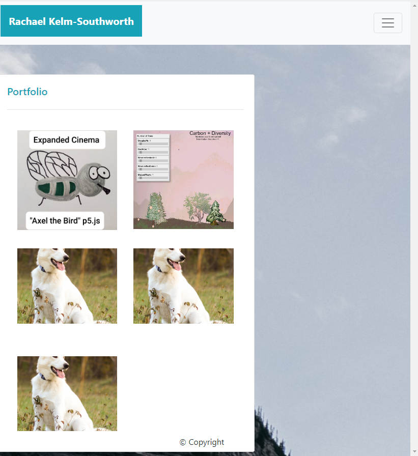

# Responsive Portfolia
<!--  
theres a section in the good read me example that says "At a minimum, your project README needs a title and a short description explaining the what, why, and how. What was your motivation? Why did you build this project? (Note: The answer is not "Because it was a homework assignment.") What problem does it solve? What did you learn? What makes your project stand out? If your project has a lot of features, consider adding a heading called "Features" and listing them here."
<!-- Functional, deployed application
GitHub repository with README describing the project
Navbar must be consistent on each page.
Navbar on each page must contain links to Home/About, Contact, and Portfolio pages.
All links must work.
Must use semantic html.
Each page must have valid and correct HTML. (use a validation service)
Must contain your personalized information. (bio, name, images, links to social media, etc.)
Must properly utilize Bootstrap components and grid system -->

### The goal of this project is to make a portfolio that works with all screen sizes using mainly the html Bootstrap framework. The portfolio needs to be beautiful, easy to use and available across different devices.  

## Table of Contents
* [Technologies Used](Technologies_Used)
* [Deployed Site](Deployed)
* [Features](Features)
* [Usage](Usage)
* [Author](Author)
* [Credits](Credits)
* [License](License)

## Technologies_Used
* HTML 
* CSS
* Bootstrap Framework

## Deployed Site
[Responsive Portfolio](https://rksouth.github.io/responsive_portfolio/)

## Features 

__1. A navbar__
 
_Why?_

In order to reach other pages of my portfolio I need a way to easily navigate between them. Another issue is that the nav bar needs to be able to adjust with the size of the viewing window, intelligently and beautifully. 

_What?/How?_
	

The original code for the navbar came from the Bootstrap framework. However, there were a few issues with it:
* It did not fix to top of the screen
* The list items were on the wrong side
* Depending on the navbar, it did not collapse (originally for me).

As you can see, I added a fixed-top section on line 29 inside if the nav class, allowing the navbar to be permanantly affixed to the top. 

On line 35, when the unordered list (ul) is created the margin is set for the line to go to left. On the middle screen-width setting, it moves the list to the margin-left using the md-auto. I am not sure why the auto is there but I do know, without it, that it will not work. 

The original [code](https://getbootstrap.com/docs/4.5/components/navbar/) has the nav buttons always located on the right so it is absolutely neccesary to go in and change it if you want them to be on right. 

I had one major hiccup with my nav bar, it didn't reduce when I reduced the screen size. Therefore, it was not responsive ***gasp***. It turns out though, that my only issue was being comment-happy. I commented out the entire toggle section and it worked just fine. 

__2. A Responsive Layout__

_Why?_

Not everyone wants to use the same size screen, sometimes we use phone sometimes we use giant monitors. The layout of my portfolio needs to look good where ever it is being viewed.

_What?/How?_
	

Above in an image of the about me or the index.html page. What is most important to note on this page is the way margins are. The fact that about me card is being filled with text. Further examples of what the website being responsive looks like can be found below. You may note at the images in the "responsive images" section that instead of having text it is the toggle box. Further comparison to this image (when considering the margin) may be helpful.
    

Below is an image of the code after it had been worked over several times. If you look you will probably be able to spot the errors.
   

As discussed with Kerwin, there is no way to use a card straight out of the box and have it be responsive. But, if you make a container over your card you make it dance like a crazy person! However, the most obvious issue is not the container's lack of column sizing but the over abundance of p tags warning of the impending doom of  card text about to come. 

Looking at my final code (likely not my final code). We can see that I have an overt fondness for paragraphs but that I included a long list of col sizing specifications.
   

I also included a style tag with a max width of 97%- this allows there to be a margin on the right hand side of the page when the text is reduced. I included a small amount of padding, because every beautiful visage deserves a little bit of padding to look at. 

__3. Responsive images__

_Why?_

If the page resizes and components of the page resize and the image doesn't, we end up with a page that is only image and nothing else. If you are working on a smaller screen this is just no beuno. It make the screen and by extension the site completely unusable and when it comes to webpage design usability needs to be the number one concern.

_What?/How?_

Above is an image of the portfolio section with a very interesting bird on it. This is the collaposed version of the website. Note how the navbar is a small drop down square instead of 3 different items and how the "bird" takes up the whole screen. The card does show some uneven margins but it does resize. Also note, how the image that was once left to to it (you can see the original below and there is nice spacing there. 

   I found the answer to be simpler than I would have originally thought. Creating first 3 rows, then 2 collumns per row, adding a padding of 3, making sure the image was fluid and that collapsed at just the right time. 
	
   
    
__3. Other/Potentional Complaints__

* The background image isn't fully on the screen (it's too big!)
_Why?_

   I originally meant to resize it using CSS to make it more navigatible. However, I decided I like the simplicty of a little bit of mountain and a lot of sky. I also anticipate that my portfolio will grow and change and as it does my background image will become more visible-as the page gets longer. I love adding those little bits of surprise to my code and designs, it's like a fruity after taste that lingers in your mouth after a really good desert. 

* I used cards instead of just containers with CSS and background applied
_Why?_

   I have a lot reasons I can give for this but mainly it's because I am too stubborn for my own good. Though, the challange was fun to try to get a card to work instead of using sanity, I would probably not do it again. I had a vision, and I was sure I could make it work. I hope, reader, that you think it worked as well as I did. 
   
   If I were going to do this again, I would use CSS or a style tag to make a background inside of a container instead of using a card. 

* Sticky footer is see-through
_Why?_

   I want my portfolio to have the feeling of airy breezy-ness. I want it to say, "this girl is classy, easy to work with and doesn't overdo it." I am from the school of design that says design should be felt, not seen. It shouldn't get in your way of the experience but enhance it. I want a sticky footer but I want one that is there without too much commotion so I did part with the asthetic a bit to do that and later I will probably go back in and make my navbar more "breezy" as well. 

## Usage
### How do you use this project? You may use it nearly anyway you see fit however, if you feel lost, scared and alone; I have some suggestions for you. 
 1. You may admire it, sit back and take in the beauty. Peruse through the code. Enjoy it as if it were an old coletrain record, Bach or Monet. So, I might not be quite there yet but not every note written by Bach was divined, Coletain didn't start out great and in the beginning Monet's art looked like everyone elses at the time.
 2. You can judge it. You can critisize and even give useful feedback. How can I improve? Do you know how to write code as beautiful as Monet paints- I want to know your secrets.
 3. You can x out. You came here by accident and only realized right now you weren't suppose to be here. So, it's cool. Have a good night. 
## Author 
Rachael Kelm-Southworth
linkedin 
github

 ## Credits

I would like to thank Kerwin, Manuel, Roger, Jerome and all my classmates for helping me understand this subject matter and anyone that contributed to make the base code (Bootstrap Framework).

## License
[MIT](https://choosealicense.com/licenses/mit/)

